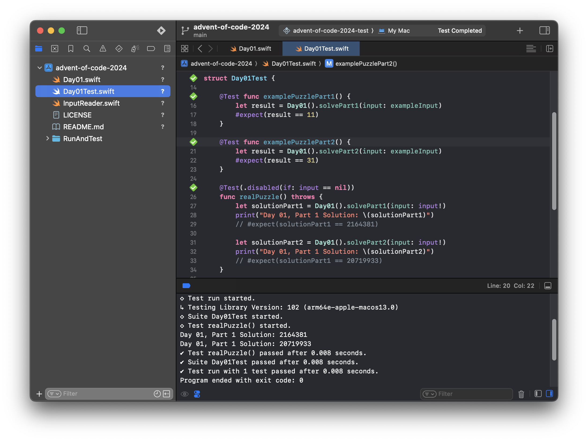

My attempts at the [Advent of Code 2024](https://adventofcode.com/2024) challenges in Swift.

## Structure of the repository

The solutions to the puzzles are in the files `Day(01-25).swift`.

The solutions are run using Xcode's testing framework. Each unit test has the name `Day(01-25)Test.swift`. Unit tests allow us to solve the puzzles incrementally, and provide a debugger to fix any issues. The downside of using a unit test is that the code will execute slower. 

Because puzzle inputs are under copyright, they are not included in the repository. Puzzle inputs must be added manually by creating files with the name `Day(01-25).txt`. The tests will be skipped if no puzzle input is present.

## Attribution

* Hero background image by [Ray Hennessy](https://unsplash.com/photos/shallow-focus-of-cardinal-bird-on-tree-branch-Gm6keHhyYxw) on [Unsplash](https://unsplash.com/).
